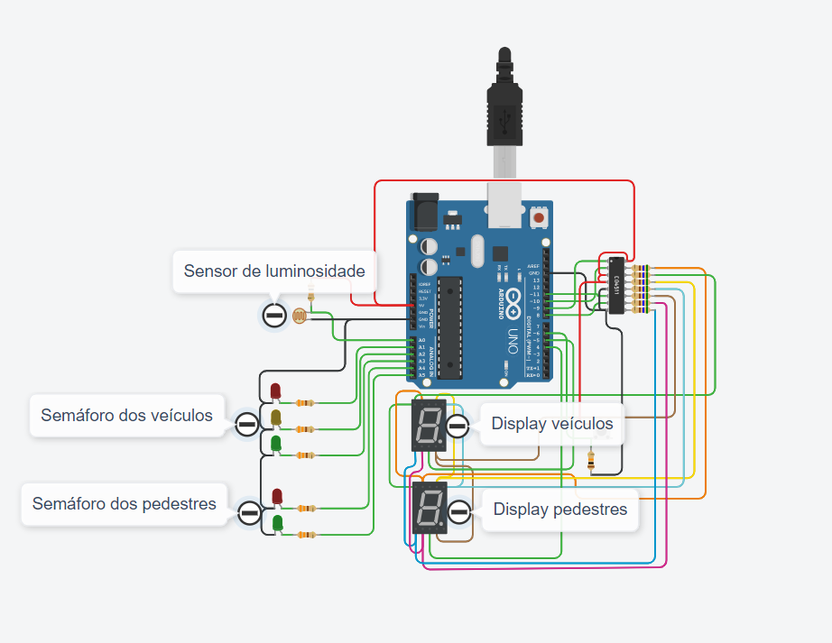

# semaforo
projeto de semáforo do curso ea076 feec

projeto no tinkercad: 
https://www.tinkercad.com/things/aqru2C4YlyA-copy-of-circuito-de-referencia-para-o-semaforo

link do fluxograma: https://excalidraw.com/#room=029f1f8105789c48c017,svo9WOEHslKvmaL2muIlKQ

